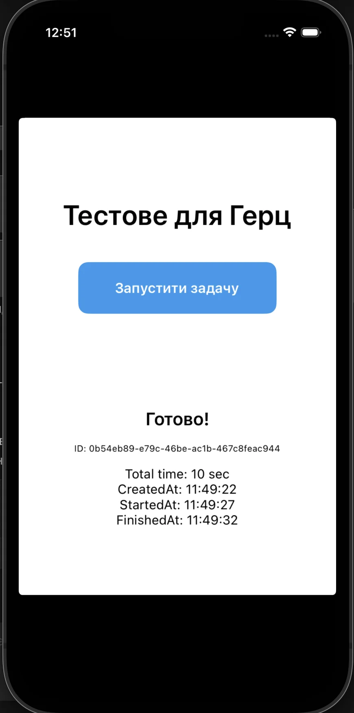
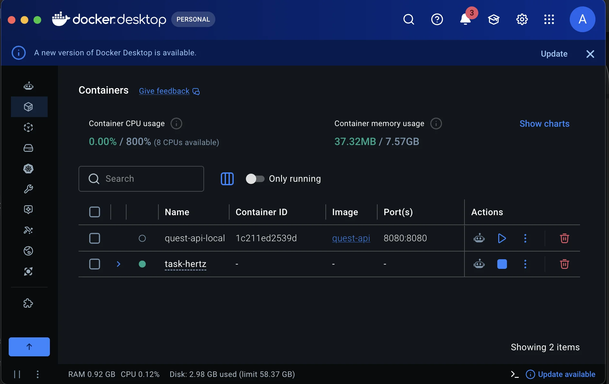
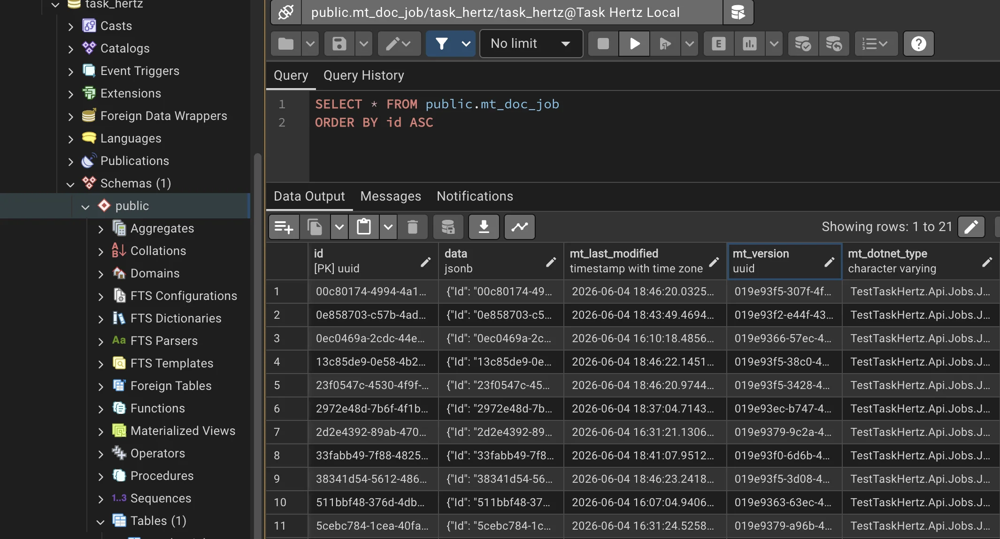

# Тестове завдання для компанії Герц

Прототип клієнт-серверної системи для відстеження тривалих фонових задач.

Проєкт містить два застосунки:

- **Backend (`src/TestTaskHertz.Api`)**: ASP.NET Core API, Marten, PostgreSQL, SignalR
- **Mobile (`src/TestTaskHertz.Mobile`)**: .NET MAUI застосунок для iOS Simulator

## Що Робить Проєкт

Мобільний застосунок створює фонову задачу на backend. Backend зберігає задачу в PostgreSQL через Marten, додає її у внутрішню чергу, обробляє через `BackgroundService` і надсилає оновлення статусу в мобільний застосунок через SignalR.

Життєвий цикл задачі:

```text
Created
  -> очікування 5 секунд
InProgress
  -> очікування 5 секунд
Completed
```

Мобільний застосунок показує:

- поточний статус: `Очікування...`, `У роботі...`, `Готово!`
- активний `ActivityIndicator` під час виконання задачі
- id задачі
- загальний час виконання
- часові мітки `CreatedAt`, `StartedAt`, `FinishedAt`

<p style="margin: 24px 0;">
  
</p>

## Структура Проєкту

```text
src/TestTaskHertz.Api      backend API
src/TestTaskHertz.Mobile   MAUI mobile app
docker-compose.yml         локальна PostgreSQL
Makefile                   допоміжні команди
docs                       скріншоти для README
```

## Запуск PostgreSQL

Запустити локальний контейнер PostgreSQL:

```bash
docker compose up -d
```

Налаштування бази даних:

```text
Host: localhost
Port: 5432
Database: task_hertz
User: task_hertz
Password: task_hertz
```

Перевірити, що контейнер запущений:

```bash
docker ps
```

Очікуваний контейнер:

```text
task-hertz-postgres
```

<p style="margin: 24px 0;">
  
</p>

## Запуск Backend

Відновити NuGet-пакети:

```bash
dotnet restore TestTaskHertz.sln
```

Запустити backend:

```bash
make b
```

Backend URL:

```text
http://localhost:5090
```

Доступні endpoints:

```text
POST /jobs
GET  /jobs/{id}
SignalR /jobsHub
```

## Перевірка Backend З Терміналу

Створити задачу:

```bash
curl -i -X POST http://localhost:5090/jobs
```

Приклад відповіді:

```json
{"jobId":"511bbf48-376d-4db5-9f26-4ff78b0722c5"}
```

Прочитати задачу:

```bash
curl http://localhost:5090/jobs/511bbf48-376d-4db5-9f26-4ff78b0722c5
```

Значення `status` є enum:

```text
0 = Created
1 = InProgress
2 = Completed
```

Зачекайте кілька секунд і викличте `GET /jobs/{id}` ще раз, щоб побачити зміну статусу і часових міток.

## Запуск Мобільного Застосунку

Запустити застосунок в iOS Simulator:

```bash
make f
```

Натиснути:

```text
Запустити задачу
```

Очікуваний flow:

```text
Очікування...
У роботі...
Готово!
```

Застосунок використовує звичайні HTTP-запити для створення/читання задачі та SignalR для real-time оновлень статусу.

## Перегляд Бази Даних Опційно

Збережені Marten-документи можна переглянути в pgAdmin.

Налаштування підключення:

```text
Host: localhost
Port: 5432
Maintenance database: task_hertz
Username: task_hertz
Password: task_hertz
```

Marten створює таблицю документів:

```text
task_hertz
  -> Schemas
    -> public
      -> Tables
        -> mt_doc_job
```

Колонка `data` зберігає серіалізований документ `Job` у форматі `jsonb`.

<p style="margin: 24px 0;">
  
</p>

## Нотатки

Проєкт таргетить `.NET 9`, щоб відповідати вимогам тестового завдання.

Мобільний проєкт містить тимчасові iOS build settings:

```xml
<ValidateXcodeVersion>false</ValidateXcodeVersion>
<MtouchLink>SdkOnly</MtouchLink>
```

Вони потрібні, щоб локальна збірка для iOS Simulator працювала, коли встановлений .NET iOS workload очікує трохи новішу minor-версію Xcode.

## Troubleshooting

Якщо backend port `5090` вже зайнятий:

```bash
lsof -nP -iTCP:5090 -sTCP:LISTEN
kill <PID>
```

Якщо PostgreSQL недоступна, переконайтеся, що Docker Desktop запущений, і перезапустіть базу:

```bash
docker compose up -d
```

Якщо VS Code показує застарілі MAUI/XAML помилки, але збірка з терміналу успішна:

```bash
dotnet build src/TestTaskHertz.Mobile/TestTaskHertz.Mobile.csproj -f net9.0-ios -r iossimulator-arm64 --tl:off
```

Потім перезавантажте VS Code:

```text
Cmd+Shift+P -> Developer: Reload Window
```
